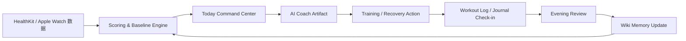

# Vela 3.0 PRD：主动式个人身体操作系统

> 文档类型：Product Requirements Document  
> 目标版本：Vela 3.0 / Active Coach OS  
> 核心目标：把 Vela 从“功能较多的健康数据 + AI Chatbot App”，升级为“每天打开就知道身体状态、训练决策和下一步行动的主动式个人身体操作系统”。

---

## 1. 背景与核心判断

### 1.1 当前问题

结合竞品调研与当前 Vela 的产品形态，Vela 现在不是“方向错”，而是“产品主轴还没有压实”。当前问题主要有四个：

1. **功能架构不够明显**  
   Vela 已经拥有 Home、Journal、Fitness、Vitals、Training、AI、Wiki、Scoring、HealthKit、Trust Center 等能力，但用户视角下不容易理解“我每天到底应该先进哪里、做什么、得到什么”。功能像模块集合，而不是一个强闭环产品。

2. **UI 精致度不足**  
   当前 UI 更像功能型 SwiftUI 原型，缺少互联网大厂产品常见的视觉统一性、层次感、动效反馈、信息密度控制和品牌化组件。健康类产品尤其依赖“可信感”和“高级感”，否则用户会觉得数据分析不够专业。

3. **页面层次偏浅**  
   当前页面多停留在一级或二级页面：Tab → 页面，或者卡片 → 简单详情。这样会导致信息不够沉淀，用户无法从“今日状态”逐步 drill down 到“证据、原因、趋势、建议、行动”。优秀健康产品往往不是简单堆页面，而是有清楚的信息纵深。

4. **AI Coach 仍像被动 Chatbot**  
   AI Coach 当前更偏“用户问，AI 答”。真正的 Coach 应该主动观察数据变化、生成报告、提出调整建议、跟踪用户反馈、维护长期记忆，并把建议转化为可执行动作，而不是只停留在聊天框。

### 1.2 竞品给 Vela 的启发

调研中的 App 可以拆成几类能力，而 Vela 不应全部照搬，而应吸收其中最适合自身定位的部分：

| 竞品类型 | 代表产品 | 可借鉴点 | Vela 的吸收方式 |
|---|---|---|---|
| 恢复/状态建议型 | Gentler Streak、Bevel、Athlytic | 把复杂指标压缩成“今天适合做什么” | Today Command Center + Readiness Decision |
| 力量训练日志型 | Strong、Hevy、训记 | 训练记录极低摩擦，训练中体验顺滑 | Training Execution Loop |
| AI 训练生成型 | Fitbod、Freeletics | Onboarding 建模强，计划生成明确 | First-Day Body Model + Adaptive Plan |
| 可穿戴数据中枢 | Garmin Connect、Polar Flow、Zepp | 数据维度完整，指标解释层次深 | Insights Drilldown + Evidence Layer |
| 轻社交/分享型 | Nike Run Club、咕咚 | 训练成果变成可分享资产 | Share Card / Weekly Card，不做社区 |
| 营养/生活方式型 | MyFitnessPal、8fit | 输入习惯和每日反馈强 | 暂不做大营养库，只保留 Journal/Check-in |
| 游戏化训练型 | Zwift | 训练中应减少干扰，训练后复盘 | iPhone 做计划/复盘，Watch 或极简界面做训练中反馈 |

### 1.3 Vela 3.0 的一句话定位

**Vela 3.0 是面向 Apple Watch 深度用户和认真训练者的个人身体操作系统：它每天主动解释你的身体状态，给出训练/恢复决策，帮助你执行训练，并把长期身体反应沉淀成个人 Wiki。**

### 1.4 产品原则

1. **少即是多：先做强一个核心循环，而不是继续平铺功能。**
2. **主动优先：AI Coach 默认主动生成 artifact，而不是等用户提问。**
3. **行动优先：每个分析结论都必须落到一个“今天该做什么”。**
4. **证据透明：每个建议都能看到数据依据、趋势、置信度和不确定性。**
5. **训练闭环：计划、执行、记录、复盘、调整必须打通。**
6. **本地优先：原始健康数据留在本地，AI 只接收结构化摘要。**
7. **高级但克制：UI 追求健康科技产品的精致感，而不是花哨装饰。**

---

## 2. 版本目标与非目标

### 2.1 版本目标

Vela 3.0 要完成五件核心事情：

1. **重构信息架构**  
   把功能从“多个并列模块”重构为“Today → Training → Insights → Coach → Profile/Wiki”的操作系统结构。

2. **建立 First-Day Body Model**  
   用户首次进入后，完成目标、训练类型、器械条件、时间约束、身体关注点、数据授权、当前状态导入，生成第一份个性化身体模型。

3. **打造 Today Command Center**  
   首页不再只是指标堆叠，而是回答三个问题：
   - 我今天身体状态如何？
   - 今天最适合做什么？
   - 为什么？下一步怎么做？

4. **升级 AI Coach 为主动式 Artifact 系统**  
   AI Coach 不再只是聊天，而是生成 Morning Brief、Workout Readiness、Training Adjustment、Evening Review、Weekly Review、Wiki Update Proposal 等结构化输出。

5. **打通训练执行闭环**  
   增加强训练模板、训练计划、组记录、组间计时、完成反馈、训练总结、PR/e1RM/肌群容量、训练后恢复关联分析。

### 2.2 非目标

Vela 3.0 不做以下内容：

1. 不做大型课程库。  
2. 不做社区动态流。  
3. 不做完整食物数据库和扫码营养记录。  
4. 不做医疗诊断。  
5. 不做多设备生态的完整商业化接入，但要预留 Data Provider Adapter。  
6. 不追求一次性重写全部代码，而是以核心闭环为中心渐进式重构。

---

## 3. 用户画像

### 3.1 Primary Persona：Apple Watch 深度用户 + 认真训练者

- 每天佩戴 Apple Watch。
- 关注睡眠、HRV、RHR、训练恢复、力量训练表现。
- 不满足 Apple Health 的原始数据展示，希望有人解释“这意味着什么”。
- 训练有计划，但经常不知道今天应该加量、减量、休息还是换训练。
- 愿意记录训练，但不能接受繁琐输入。

核心需求：

> “不要只给我一堆数据。告诉我今天身体怎么样，今天怎么练，为什么这样安排，并在训练后帮我复盘。”

### 3.2 Secondary Persona：恢复敏感型用户

- 睡眠、压力、疲劳波动明显。
- 容易训练过度或训练不连续。
- 对“今天是否适合高强度”非常敏感。

核心需求：

> “我需要一个不会一味催我训练，而是知道什么时候该休息的健康助手。”

### 3.3 Tertiary Persona：轻度健身用户

- 想减脂、保持活跃、改善睡眠。
- 不需要复杂力量训练细节。
- 更关注每日建议和周报。

核心需求：

> “给我一个简单、可信、容易坚持的日常健康建议。”

---

## 4. 核心产品循环

### 4.1 当前应建立的主循环



### 4.2 每日用户路径

1. 早上打开 Vela。  
2. 看到 Today Hero：恢复、睡眠、压力、耗力、训练准备度。  
3. Vela 给出今日决策：正常训练、减量训练、替换训练、恢复日。  
4. 用户点击“Why this?” 查看证据。  
5. 用户开始训练或执行恢复行动。  
6. 训练中低摩擦记录。  
7. 训练后获得总结：容量、有效组、肌群、PR、e1RM、疲劳影响。  
8. 晚上 Vela 生成 Evening Review。  
9. 关键变化写入 Wiki，形成长期个体反应模型。

---

## 5. 信息架构重构

### 5.1 新 Tab 结构

建议将底部主导航重构为五个主入口：

| Tab | 中文名称 | 角色 | 原有模块归属 |
|---|---|---|---|
| Today | 今日 | 每日身体状态与行动决策中心 | Home、Morning Brief、Today Plan |
| Training | 训练 | 计划、执行、记录、训练复盘 | Fitness、TrainingIntelligence、Workout Record |
| Insights | 洞察 | 睡眠、恢复、压力、耗力、心率、趋势分析 | Vitals、Scoring、Health |
| Coach | 教练 | AI Artifact、主动建议、问答、计划生成 | AI、Vela Intelligence |
| Me | 我的 | Wiki、Journal、Profile、Settings、Trust Center | Journal、Wiki、Settings、Trust |

### 5.2 为什么这样改

当前 Home / Journal / Fitness / Vitals / + Intelligence 的结构有一个问题：**它更像按数据来源和功能模块分区，而不是按用户任务分区。**

Vela 3.0 应按用户任务分区：

- 我今天该做什么？→ Today
- 我要训练/记录训练 → Training
- 我想看身体趋势 → Insights
- 我要让 AI 帮我解释/计划 → Coach
- 我要管理我的长期身体档案 → Me

### 5.3 页面层级设计

Vela 3.0 应形成四级层次：

```text
Level 0: Tab
Level 1: Workspace Hub
Level 2: Domain Detail / Artifact Detail / Plan Detail
Level 3: Evidence / Edit / Data Source / Historical Comparison
```

示例：

```text
Today
 ├─ Today Command Center
 │   ├─ Readiness Decision Detail
 │   │   ├─ Why This? Evidence Sheet
 │   │   └─ Alternative Actions
 │   ├─ Today Plan Detail
 │   └─ Morning Brief Artifact

Training
 ├─ Week Plan
 │   ├─ Workout Template Detail
 │   ├─ Workout Session
 │   │   ├─ Exercise Detail
 │   │   ├─ Set Editor
 │   │   └─ Rest Timer
 │   └─ Workout Summary

Insights
 ├─ Recovery
 │   ├─ HRV Trend
 │   ├─ RHR Trend
 │   └─ Data Source / Confidence
 ├─ Sleep
 ├─ Strain
 └─ Stress

Coach
 ├─ Artifact Inbox
 │   ├─ Morning Brief
 │   ├─ Weekly Review
 │   ├─ Training Adjustment
 │   └─ Wiki Update Proposal
 └─ Ask Coach

Me
 ├─ Body Wiki
 ├─ Journal History
 ├─ Goal & Profile
 ├─ Health Permissions
 └─ Trust Center
```

---

## 6. 功能需求

## 6.1 First-Day Body Model / 首日建模

### 6.1.1 目标

首次进入 App 时，不要直接把用户扔进一堆空页面，而是通过一个高质量 onboarding，把用户变成一个可被 Vela 理解的个体。

### 6.1.2 流程

```text
Welcome → Value Proposition → Health Permission → Goal Setup → Training Profile → Equipment & Schedule → Body Concerns → Baseline Import → First Brief → First Plan
```

### 6.1.3 需要收集的信息

| 类型 | 字段 | 示例 |
|---|---|---|
| 基本目标 | primaryGoal | 增肌、减脂、力量提升、改善恢复、改善睡眠 |
| 训练类型 | trainingStyle | 力量、跑步、混合、恢复优先 |
| 训练频率 | weeklyTrainingDays | 3/4/5/6 天 |
| 时间约束 | sessionDuration | 30/45/60/90 分钟 |
| 器械条件 | equipmentProfile | 健身房、哑铃、自重、跑步机 |
| 经验水平 | experienceLevel | 新手、中级、进阶 |
| 关注点 | bodyConcerns | 睡眠差、压力大、容易疲劳、膝盖不适等 |
| 健康数据授权 | HealthKit scopes | 睡眠、心率、HRV、活动、训练、体重等 |
| AI 偏好 | coachingStyle | 直接型、解释型、温和型 |

### 6.1.4 输出

Onboarding 完成后必须生成三类输出：

1. **Body Snapshot**  
   当前身体状态摘要：睡眠、恢复、训练负荷、活动水平、数据完整度。

2. **User Body Model v1**  
   用户目标、训练偏好、时间限制、器械条件、恢复敏感点。

3. **First Action Plan**  
   未来 3 天建议：训练/恢复/观察安排。

### 6.1.5 验收标准

- 新用户首次打开不再看到空 dashboard。
- Onboarding 完成后 Today 页面有具体建议。
- 用户可以跳过部分问题，但系统必须标记数据置信度。
- 所有采集信息写入本地 SwiftData，不直接发送原始健康数据。

---

## 6.2 Today Command Center / 今日指挥中心

### 6.2.1 目标

Today 是整个 App 的最高优先级页面。它必须在 10 秒内回答：

1. 今天我身体状态怎么样？
2. 今天适合训练吗？
3. 今天最重要的一件事是什么？
4. 为什么？

### 6.2.2 页面结构

```text
Today
 ├─ Header: 日期 + 状态短语
 ├─ Body State Hero
 ├─ Readiness Decision Card
 ├─ Today Action Stack
 ├─ Key Signals
 ├─ Coach Brief
 ├─ Quick Check-in
 └─ Timeline / Recent Changes
```

### 6.2.3 Body State Hero

Hero 卡片应包含：

- 今日状态标题：如“Ready but watch fatigue” / “恢复不足，建议减量”
- 综合状态分数：Recovery / Readiness / Strain Balance
- 一句话解释：如“睡眠时长正常，但 HRV 低于 14 天基线，建议降低下肢训练容量。”
- 主 CTA：Start Today Plan / Adjust Plan / Log Check-in
- 次 CTA：Why this?

### 6.2.4 Readiness Decision

决策类型：

| 决策 | 含义 | 训练建议 |
|---|---|---|
| keep | 状态正常 | 按原计划训练 |
| reduce | 恢复一般 | 降低容量或强度 |
| swap | 局部疲劳明显 | 替换训练内容 |
| recover | 恢复不足 | 休息或主动恢复 |

每个决策必须包含：

- decision
- confidence
- reasons[]
- supportingSignals[]
- suggestedActions[]
- userOverrideAvailable

### 6.2.5 Key Signals

展示 3–5 个最重要信号，不能展示太多：

- Sleep Score / Sleep Duration / Sleep Debt
- HRV vs Baseline
- Resting Heart Rate vs Baseline
- Recent Training Load
- Local Muscle Fatigue
- Journal Mood / Soreness

### 6.2.6 验收标准

- Today 页面不再是指标罗列，而是明确决策页。
- 每张建议卡都能打开 Why This 解释。
- 所有指标都显示数据更新时间和置信度。
- 如果 HealthKit 数据不足，页面显示“数据不足但可行动”的 fallback。

---

## 6.3 Training Execution Loop / 训练执行闭环

### 6.3.1 目标

把 Vela 从“会分析训练”升级为“能支持训练全过程”：计划 → 开始 → 记录 → 总结 → 调整。

### 6.3.2 核心能力

1. 训练模板库  
2. 今日训练计划  
3. 训练中记录  
4. 组间计时  
5. 上次表现自动填充  
6. 完成组按钮  
7. 训练总结  
8. PR / e1RM / 容量 / 肌群统计  
9. 训练后写入 DailyHealthSummary  
10. 第二天恢复反馈关联

### 6.3.3 训练模板

模板字段：

```swift
WorkoutTemplate
- id
- name
- goal
- estimatedDuration
- targetMuscleGroups
- exercises[]
- defaultRestSeconds
- progressionRule
- createdAt
- updatedAt
```

### 6.3.4 训练记录

```swift
StrengthWorkoutRecord
- id
- date
- templateId?
- duration
- exercises[]
- totalVolume
- effectiveSets
- muscleGroupSets
- estimatedFatigue
- perceivedExertion
- notes
- source
```

### 6.3.5 Exercise Set

```swift
ExerciseSetRecord
- exerciseId
- setIndex
- weight
- reps
- rir
- rpe
- completed
- restSeconds
- isWarmup
```

### 6.3.6 Workout Summary

训练结束后生成：

- 总容量 totalVolume
- 有效组 effectiveSets
- 肌群组数 muscleGroupSets
- e1RM 估计
- PR 检测
- 与上次训练对比
- 今日训练与 readiness 的关系
- AI 总结：本次训练是否符合今日身体状态

### 6.3.7 验收标准

- 用户可以在 3 秒内完成一组记录。
- 用户可以一键复制上次重量和次数。
- 训练结束自动生成总结。
- 训练记录写入当天 DailyHealthSummary。
- 第二天 Morning Brief 能引用昨天训练摘要。

---

## 6.4 AI Coach 2.0 / 主动式 Artifact 系统

### 6.4.1 目标

AI Coach 不再等用户问问题，而是主动生成结构化教练输出。

### 6.4.2 Coach 的四种工作模式

| 模式 | 说明 | 示例 |
|---|---|---|
| Observe | 观察数据变化 | “昨晚 HRV 低于基线 12%。” |
| Diagnose | 解释原因 | “可能与昨天高容量下肢训练有关。” |
| Decide | 给出决策 | “今天建议上肢轻量训练，避免高强度腿部。” |
| Follow-up | 跟踪反馈 | “训练后请记录疲劳感，明天我会对比恢复变化。” |

### 6.4.3 Artifact 类型

| Artifact | 触发时机 | 作用 |
|---|---|---|
| Morning Brief | 每天早上/首次打开 | 今日身体状态与行动建议 |
| Workout Readiness | 进入 Training 前 | 判断是否按计划训练 |
| Training Adjustment | 状态异常或局部疲劳 | 调整训练内容 |
| Post-Workout Review | 训练完成后 | 训练总结和恢复预测 |
| Evening Review | 晚上或用户 check-in 后 | 复盘当天行为和状态 |
| Weekly Review | 每周 | 趋势、训练、恢复、建议 |
| Wiki Update Proposal | 发现长期规律时 | 请求用户确认写入长期记忆 |
| Ask Coach Answer | 用户主动提问 | 即时回答，但要关联数据和行动 |

### 6.4.4 Artifact UI

Coach 页面不应是纯聊天流，而应是：

```text
Coach
 ├─ Today Coach Card
 ├─ Artifact Inbox
 │   ├─ Morning Brief
 │   ├─ Training Adjustment
 │   ├─ Weekly Review
 │   └─ Wiki Update Proposal
 ├─ Suggested Questions
 └─ Ask Coach Chat
```

Chat 仍保留，但不是主角。

### 6.4.5 AI 输出格式

所有 AI 输出必须是结构化 JSON，然后由 SwiftUI 渲染成卡片。

示例：

```json
{
  "artifactType": "morning_brief",
  "title": "今天适合减量训练",
  "summary": "睡眠充足，但 HRV 低于基线且下肢局部负荷偏高。",
  "decision": "reduce",
  "confidence": 0.78,
  "reasons": [
    {
      "signal": "HRV",
      "value": "below_baseline",
      "explanation": "HRV 低于 14 天基线，提示恢复压力偏高。"
    }
  ],
  "actions": [
    {
      "type": "adjust_workout",
      "label": "将今天训练容量降低 20%",
      "payload": {}
    }
  ],
  "followUpQuestion": "训练后是否感觉异常疲劳？"
}
```

### 6.4.6 Coach 主动触发规则

| 事件 | 触发 |
|---|---|
| 新睡眠数据可用 | 生成 Morning Brief |
| 用户打开 Training | 生成 Workout Readiness |
| 用户完成训练 | 生成 Post-Workout Review |
| 用户连续 3 天恢复下降 | 生成 Recovery Warning |
| 每周固定周期 | 生成 Weekly Review |
| 用户修改目标 | 重新生成 Plan |
| 发现规律 | 生成 Wiki Update Proposal |

### 6.4.7 验收标准

- Coach 首页默认展示 artifact，不是空聊天框。
- 每个 artifact 都有行动按钮。
- AI 回答必须引用当前数据摘要，而不是泛泛建议。
- 用户可以接受/拒绝 Wiki Update。
- AI 输出失败时有本地 fallback。

---

## 6.5 Insights Drilldown / 指标洞察纵深

### 6.5.1 目标

Insights 不只是展示分数，而是建立“分数 → 原因 → 趋势 → 证据 → 行动”的纵深。

### 6.5.2 Insights 首页

```text
Insights
 ├─ Recovery
 ├─ Sleep
 ├─ Strain
 ├─ Stress
 ├─ Heart
 ├─ Body
 └─ Trends
```

### 6.5.3 单指标详情页结构

每个指标页统一模板：

```text
Metric Detail
 ├─ Current Value
 ├─ Status Label
 ├─ Trend Chart
 ├─ Baseline Comparison
 ├─ Contributors
 ├─ Interpretation
 ├─ Recommended Action
 ├─ Data Source
 └─ Confidence / Limitations
```

### 6.5.4 统一解释语言

每个指标必须避免“神秘分数”。示例：

错误：

> 恢复分 62。

正确：

> 恢复一般。主要原因是 HRV 低于你的 14 天基线，同时昨天训练容量偏高。今天建议降低训练容量或优先上肢轻量训练。

### 6.5.5 验收标准

- 所有核心指标详情页结构一致。
- 每个分数都有 baseline comparison。
- 每个建议都有 evidence。
- 用户知道数据来自 Apple Health、手动记录还是 AI 推断。

---

## 6.6 Wiki Memory / 个人身体知识库

### 6.6.1 目标

Wiki 不应只是 AI 内部上下文，而应成为用户可读、可编辑、可追溯的个人身体档案。

### 6.6.2 Wiki 分类

```text
Body Wiki
 ├─ Goals & Preferences
 ├─ Training Profile
 ├─ Recovery Patterns
 ├─ Sleep Patterns
 ├─ Nutrition Notes
 ├─ Injury / Limitation Notes
 ├─ What Works
 └─ What Does Not Work
```

### 6.6.3 Wiki Update Proposal

当 AI 发现规律时，不自动静默写入，而是生成提案：

```text
我发现：过去 4 次高容量腿部训练后的第二天，你的 HRV 平均下降明显，并且主观疲劳更高。
是否写入 Wiki："高容量腿部训练后通常需要更长恢复"？
[接受] [编辑] [拒绝]
```

### 6.6.4 验收标准

- 用户可以查看 AI 记住了什么。
- 用户可以编辑或删除记忆。
- 每条记忆有来源：哪几天的数据、哪次训练、哪次 check-in。
- Coach 生成建议时可以引用 Wiki。

---

## 6.7 UI / Design System 2.0

### 6.7.1 设计方向

Vela 3.0 的 UI 应定位为：

> **Calm Premium Health Intelligence**  
> 冷静、高级、可信、数据感强，但不冰冷。

参考气质：

- Apple Health 的系统可信感。
- Gentler Streak 的柔和状态表达。
- Bevel/Athlytic 的数据密度。
- Linear/Arc 这类现代软件的克制高级感。
- Nike Run Club 的成就感和可分享表达。

### 6.7.2 视觉原则

1. **更强标题层级**：大标题、状态短语、关键数字形成视觉锚点。  
2. **减少卡片杂乱**：每屏 1 个主卡 + 2–4 个辅助模块。  
3. **语义色彩而不是彩虹色**：颜色服务状态，不做装饰。  
4. **统一组件语言**：所有 metric、artifact、action、chart 使用统一组件。  
5. **微动效反馈**：卡片展开、状态切换、训练完成、artifact 生成要有细腻动效。  
6. **空状态也要高级**：数据不足时给出清楚解释和下一步行动。  
7. **Dark Mode first**：健康数据和夜间查看场景更适合暗色优先，再适配浅色。

### 6.7.3 关键组件

| 组件 | 用途 |
|---|---|
| VelaPageShell | 统一页面背景、导航、safe area |
| VelaHeroCard | Today Hero / Metric Hero |
| MetricScoreCard | 指标分数卡 |
| SignalRow | 指标信号行 |
| EvidenceSheet | Why This 证据解释 |
| CoachArtifactCard | AI Artifact 卡片 |
| ActionStack | 今日行动列表 |
| WorkoutSessionCard | 训练中动作卡 |
| SetInputRow | 组记录输入 |
| TrendChartCard | 趋势图卡片 |
| EmptyStateView | 空状态 |
| DataSourceBadge | 数据来源标签 |
| ConfidenceBadge | 置信度标签 |

### 6.7.4 验收标准

- 所有新页面使用 Design System 组件，不直接堆散乱 SwiftUI 样式。
- Today / Training / Insights / Coach 有统一视觉语言。
- 支持 Dynamic Type、VoiceOver 基本可访问性。
- 关键页面首屏视觉重心明确。

---

## 7. 数据与工程需求

### 7.1 本地优先

- 原始 HealthKit 数据只在本地读取与聚合。
- 发送到 LLM 的必须是结构化摘要，不包含不必要的原始敏感数据。
- 用户可查看哪些摘要被用于 AI。

### 7.2 Context Builder 2.0

AI Context 应至少包含：

```text
- userProfileSummary
- currentGoals
- healthSummaryToday
- sleepSummaryLastNight
- recoverySignals
- strainSignals
- recentWorkouts
- plannedWorkoutToday
- localMuscleFatigue
- journalSignals
- wikiFacts
- dataConfidence
- missingData
```

### 7.3 Artifact Persistence

所有 AI artifact 应可持久化：

```swift
CoachArtifact
- id
- type
- title
- summary
- createdAt
- relatedDate
- decision
- confidence
- reasons
- actions
- sourceContextHash
- userFeedback
- status
```

### 7.4 DailyHealthSummary 同步

训练记录完成后，应同步到当天 DailyHealthSummary：

```text
StrengthWorkoutRecord → DailyHealthSummary.trainingSummary
```

包括：

- strengthSessionsCount
- totalVolume
- effectiveSets
- muscleGroupSets
- maxRPE
- trainingDuration
- workoutTags
- fatigueEstimate

### 7.5 测试需求

必须补足：

- ScoringEngineTests
- ContextBuilderTests
- CoachArtifactParserTests
- TrainingRecordPersistenceTests
- DailyHealthSummarySyncTests
- OnboardingStateTests
- Snapshot Tests for critical views
- UI tests for onboarding / training log / artifact flow

---

## 8. 成功指标

### 8.1 产品体验指标

| 指标 | 目标 |
|---|---|
| 首日完成建模率 | 用户能完成 onboarding 并看到 First Brief |
| 首次行动转化 | 用户根据 Today 建议完成一个 action |
| 训练记录完成率 | 用户能完整记录一次训练 |
| Artifact 阅读率 | Morning Brief / Weekly Review 被打开 |
| Why This 点击率 | 用户愿意查看建议依据 |
| Wiki 接受率 | 用户接受 AI 记忆提案 |

### 8.2 工程质量指标

| 指标 | 目标 |
|---|---|
| 核心测试通过 | 全部 unit tests 通过 |
| 关键流程稳定 | onboarding、today、training、coach 无崩溃 |
| 数据缺失处理 | HealthKit 不完整时仍可使用 |
| 性能 | Today 首页加载流畅，无明显阻塞 |
| 隐私 | AI 请求不包含原始 HealthKit 明细 |

---

## 9. 发布范围

### 9.1 必须交付

1. 新 Tab 信息架构。  
2. First-Day Body Model onboarding。  
3. Today Command Center。  
4. AI Coach Artifact Inbox。  
5. Morning Brief / Workout Readiness / Post-Workout Review。  
6. Strength training execution loop。  
7. Workout summary。  
8. Wiki Update Proposal。  
9. Design System 2.0 基础组件。  
10. 核心测试。

### 9.2 可以后置

1. 分享卡片导出。  
2. Apple Watch 训练中 companion。  
3. 多设备适配层。  
4. 完整营养模块。  
5. 高级周期化训练计划。

---

## 10. 最大风险

### 10.1 范围失控

风险：继续堆功能，导致 Vela 3.0 变成更复杂的 Vela 2.x。  
控制：以 Today + Training + Coach Artifact 为主，其他模块服务这三个核心。

### 10.2 AI 不稳定

风险：LLM 输出不稳定，导致 UI 解析失败或建议不可信。  
控制：所有 AI 输出必须结构化，必须有本地 fallback，必须有 confidence 和 evidence。

### 10.3 训练记录摩擦过高

风险：训练中输入繁琐，用户放弃记录。  
控制：优先做复制上次表现、完成组按钮、组间计时、默认值自动填充。

### 10.4 UI 过度设计

风险：追求精致导致开发复杂度过高。  
控制：先建立组件系统，而不是逐页手工美化。

### 10.5 数据不足

风险：新用户或 HealthKit 数据不足时无法给建议。  
控制：建立 dataConfidence 与 fallback 建议，不因数据不足而空白。

---

## 11. 最终验收定义

Vela 3.0 完成时，应满足以下判断：

1. 用户首次进入能完成建模，并看到第一份个性化建议。  
2. 用户每天打开 Today，能立刻知道今天该训练、减量、替换还是恢复。  
3. 用户能顺滑完成一次力量训练记录。  
4. 训练记录能影响后续 Daily Summary、Morning Brief 和 Coach 建议。  
5. AI Coach 默认展示 artifact，而不是空聊天框。  
6. 每个建议都有 Why This 解释。  
7. Wiki 变成用户可读、可编辑、可追溯的长期身体记忆。  
8. UI 风格明显更统一、更高级、更像一个成熟健康科技产品。  
9. 核心流程有测试覆盖。  
10. Vela 的定位从“健康数据 App + AI”变成“主动式个人身体操作系统”。
