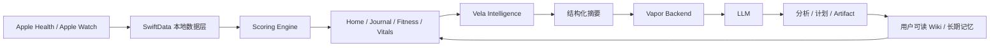
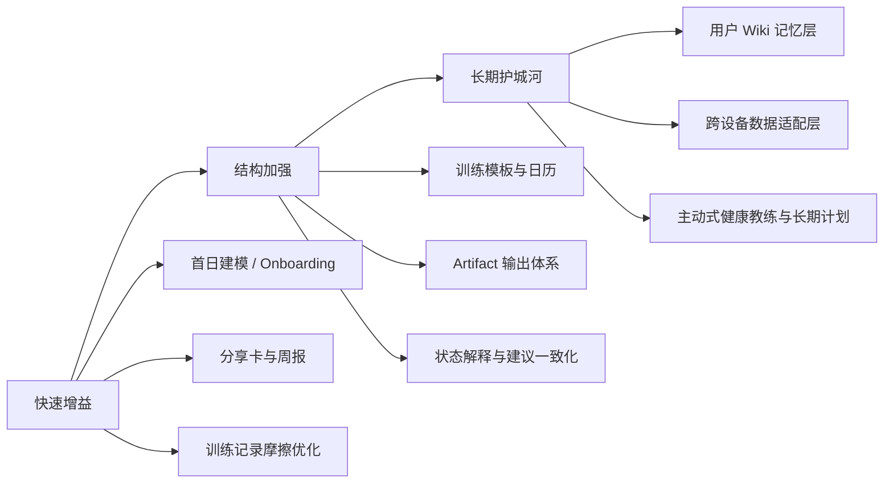

# Vela 仓库与 iOS 健身应用市场深度分析报告

## 执行摘要

从仓库本身看，Vela 不是一个“通用健身 App”原型，而是一条已经相当明确的产品路线：**以 Apple Health / Apple Watch 生态为核心、强调 local-first、可解释评分、训练智能和 AI 记忆层的健康情报应用**。公开页面显示该仓库为纯 Swift 项目，根目录同时包含 iOS 主工程、测试 Target、Vapor 后端、以及大量产品与算法文档；`CLAUDE.md` 进一步明确其技术栈为 **SwiftUI + SwiftData + HealthKit**，并说明“原始健康数据留在本地，只有结构化摘要发送给 LLM”，后端默认对接 Claude，也可切换 DeepSeek。产品文档则把当前目标直接定义为“Bevel 3.0-class health companion”，并把差异化点写成三件事：**local-first 架构、用户可读的 Wiki memory、Training Intelligence engine**。citeturn37view0turn40view0turn43view2turn43view3turn43view4

从竞争格局看，iOS 健身市场已经明显分层：一类做**运动记录与训练日志**，像 训记、Strong、Hevy；一类做**AI/课程式训练指导**，像 Fitbod、Freeletics、Seven、8fit；一类做**恢复与可穿戴健康分析**，像 Gentler Streak、Garmin Connect、Polar Flow、Zepp；还有一类做**游戏化或社区型训练**，像 Zwift、Nike Run Club、咕咚。Vela 当前文档与代码结构最接近的是 **Gentler Streak + Bevel 风格的信息架构**，其次是 **Fitbod / Freeletics 的训练智能层**；它与咕咚这类“大而全内容社区”和 MyFitnessPal 这类“营养数据库型产品”相比，路线明显更偏“个人健康操作系统”。citeturn15search1turn15search2turn16search1turn17search0turn17search6turn23search0turn23search1turn13search1

对你最重要的结论不是“Vela 该不该继续做健康助手”，而是**该不该继续收窄焦点**。我的判断是：**应该继续收窄，并把产品主轴固定为“可解释的个人身体状态 + 训练决策 + AI 健康记忆”，而不是扩成课程/社区/营养超级 App**。因为仓库已经在文档层面建立了很强的方向一致性，但在可验证的代码层，仍更像“雄心很大的产品蓝图 + 一批结构化模块 + 部分实现中的前端工作区”，离“磨到强留存的单点体验”还有明显距离。真正可借鉴的竞品能力，不是全部照搬，而是把它们拆成四类能力：**更强 onboarding、更强日志与计划执行、更强社交轻分享、更强 AI 输出物**。citeturn37view0turn40view2turn40view3turn43view2turn43view3turn43view4turn10search6turn17search10turn16search1turn11search9

## Vela 仓库审查

仓库首页显示，Vela 当前包含 `Vela.xcodeproj`、`VelaApp`、`VelaAppTests`、`VelaBackend`、`docs` 等顶级目录，并有 57 次提交、尚未发布 Release、语言为 100% Swift。`VelaApp` 目录继续拆分为 `AI`、`App`、`Core`、`Features`、`Health`、`Journal`、`Persistence`、`Resources`、`Scoring`、`TrainingIntelligence` 等十个子模块；`Core` 又进一步分为 `Constants`、`DesignSystem`、`Extensions`、`Services`、`Settings`、`Theme`、`Utilities`。这说明它已经不是单文件原型，而是一个相对成熟的模块化应用骨架。citeturn37view0turn40view2turn41view1

`CLAUDE.md` 是本仓库最有信息密度的一手文档：它明示 Vela 的定位是 **local-first iOS 健康分析 App**，技术选型为 **SwiftUI + SwiftData + HealthKit**，原始健康数据保留在本地，只把结构化摘要发给 LLM；后端位于 `VelaBackend`，使用 Vapor 4 和 SQLite，默认模型为 Claude，也兼容 DeepSeek。`PRD.md` 又把产品目标升级为“Bevel 3.0-class health companion”，并强调差异化来自 local-first、可读 Wiki memory 和 Training Intelligence。`SCORING_SYSTEM_V1_0.md` 还把评分系统定义为“local-first、explainable、baseline-focused”的统一评分协议。换句话说，Vela 的**产品、工程、算法三层叙事是一致的**。citeturn40view0turn43view2turn43view3turn43view4

在导航与信息架构上，仓库根 README 明确写了当前 build direction：底部是 Apple-like glass navigation bar，核心工作区为 **Home、Journal、Fitness、Vitals**，右侧单独的 `+` 打开 **Vela Intelligence**；底部 tab 是聚合工作区，而首页评分卡与指标行进入单一指标 drilldown。README 还具体写到：Journal 以 daily entry board 开始；Fitness 首页包括 30 日热力图、activity summary、strain performance、training readiness；Vitals 以 recovery 和 biology/body metrics 为起点；Sleep 有独立睡眠面板；Training 是“adaptive plan workspace”；`+` 是 full-screen intelligence action hub，提供 Ask、Analyze Today、Update Wiki、Generate Plan、check-ins 和 quick prompts。**这已经不是普通 tab-bar app，而是一个健康操作系统式的信息架构。**citeturn37view0

就数据流而言，文档已经能推断出一条相对清晰的链路：**HealthKit / 本地持久层 → 统一评分系统 → 工作区与指标 drilldown → Vela Intelligence → 结构化摘要发往 Vapor 后端 → LLM 返回分析/计划/工件 → 回写用户可读 Wiki 与长期趋势**。AI Agent 规范把能力分成“即时问答、固定报告、长期教练”三层，固定报告包括 Morning Brief、Sleep Review、Workout Readiness、Weekly Review；长期能力依赖历史报告、Journal、用户 Wiki 和健康趋势。这个设计对可解释性与留存都很有帮助，因为它天然支持“今天为什么这样”“过去两周发生了什么”“接下来怎么做”三种问题。citeturn43view3turn43view4turn37view0

在后端与配置层，`VelaBackend/Package.swift` 直接暴露了核心依赖：**Vapor、Fluent、SQLite driver、Postgres driver、JWT、Leaf**。这意味着后端目标并不只是“轻量 proxy”，而是具备鉴权、ORM、多数据库和服务端模板能力的可扩展服务。`.env.example` 也清楚列出 `JWT_SECRET`、`ANTHROPIC_API_KEY`、`ANTHROPIC_BASE_URL`、`LLM_MODEL`、`DATABASE_URL`、`PORT`、`HOSTNAME`、`LOG_LEVEL` 等环境变量，说明至少已经考虑了开发/生产环境差异与基础安全配置。citeturn43view0turn43view1

测试面上，`VelaAppTests` 至少覆盖了 `AgentActionParserTests`、`ContextBuilderTests`、`HealthFoundationTests`、`MemoryLedgerTests`、`PersistenceFoundationTests`、`PromptComposerTests`、`ScoringEngineTests` 等文件；后端也有单独的 `Tests/AppTests`。这说明仓库已对 **AI 解析、上下文构建、健康基础层、记忆账本、持久化、Prompt 组合、评分引擎** 做了一定的单元测试布局。优点是：仓库把最容易“表面能跑、长期不稳”的底层能力先纳入测试。缺点是：从当前可见页面里，看不到 **UI tests、snapshot tests、端到端集成测试、性能基准、可访问性测试** 的证据，因此“核心逻辑有测试”不等于“体验层已稳定”。citeturn40view3turn40view4

从优势角度看，Vela 当前仓库最强的地方有三点。第一，**方向统一**：产品文档、算法文档、AI 规范、模块拆分、导航描述都围绕同一个核心假设组织，而不是一堆松散功能。第二，**隐私叙事清晰**：local-first 与结构化摘要出海的方式，比把原始健康数据全送到云端更容易获得高端 iPhone / Apple Watch 用户信任。第三，**可解释评分**：用统一 `MetricResult` 协议承接多领域评分，天然适合 drilldown、AI explain、长期比较和 artifact 生成。citeturn40view0turn43view2turn43view3turn43view4

从短板角度看，Vela 也暴露出一些很典型的“强蓝图、弱交付”问题。最直观的是：仓库显示 **No releases published**，公开页面里也未能看到已形成闭环的版本节奏；同时根 README 明确写着“current frontend direction is frozen”，“future UI work is limited to incremental fixes and refinements while backend data contracts are aligned”，这通常意味着前端形态已经先走一步，而后端契约与最终产品化仍在追赶。其次，虽然模块很多，但可直接验证的代码细节有限，甚至 `VelaApp/App` 页面在本轮抓取中返回了异常，这使得我们无法完成更细粒度的 state management、路由实现和 view composition 静态审查。最后，Nutrition 明确被写成“foundation exists, but productization is paused”，说明 Vela 当前仍不是一个完整的“全栈健康生活方式平台”。citeturn37view0turn41view0

## 健身应用市场版图

iOS 健身应用不宜按“健身 App”一锅端，而应按用户想完成的任务来分。结合本次核验到的一手页面，至少可以分成七类：**运动追踪、力量训练日志、AI/课程式训练、恢复与可穿戴分析、营养管理、游戏化训练、康复/理疗**。这七类在界面结构、数据密度、留存机制和商业模式上差异很大；如果不先选主类目，就很容易把产品做成“全都沾一点，但没有一项做到每天必开”。citeturn10search6turn15search1turn15search2turn16search1turn17search0turn18search1turn11search1turn20search1

在**国内样本**里，咕咚代表的是“赛事 + 运动记录 + 平台型社区”路径。它的官方页面强调“一站式运动健身和马拉松骑行赛事活动平台”，并在更新日志里持续强化新人路径、运动分享模板、线上赛与虚拟“手办”资产；这类设计的核心不是算法深度，而是 **活动驱动、分享驱动、任务驱动** 的增长和留存。训记则几乎站在另一端：官方页面把自己定义为“比较硬核”的健身 App，强调**记录到每一组重量和次数**、强调“足够自由”，本质上是服务认真训练者的日志和分析工具。Zepp 则代表国产可穿戴生态的“数据中枢”路线：它覆盖心率、睡眠、压力、血氧、步数、配速、距离、力量记录、恢复洞察和设备定制，并把数据安全、区域存储、加密和 GDPR 合规写进官方介绍。citeturn15search1turn15search2turn13search1turn13search12

在**国际样本**里，Nike Run Club 与 adidas Running 代表跑步与活动追踪的大众化路线。NRC 提供 GPS 跑步跟踪、语音指导、个性化训练计划、挑战、徽章/奖杯、排行榜、好友加油、跑后分享卡片和 Apple Watch 深度支持；Apple 的编辑故事还特别点出它把配速、距离、分段、海拔和心率等信息做成“易读且漂亮的图表”。adidas Running 则强调面向各能力层级的 activity tracker 与可适应不同用户水平的训练计划。**这类产品的壁垒，不在于采集数据，而在于把“训练痛苦”包装成“可持续任务”。** citeturn10search6turn10search8turn10search5

在**AI / 训练生成**这一层，Fitbod、Freeletics、Seven、8fit 的代表性很强。Fitbod 明确把自己定位为“个性化力量训练 app”，根据目标、训练水平、器械条件和恢复状态生成计划；Freeletics 则把“AI Coach”“Training Journey”“按表现调整计划”写成核心卖点；Seven 把“7 分钟 + 目标与水平设定 + 个性化计划”做成极低门槛入口；8fit 则把 fitness 和 meal plans 绑定成更完整的 lifestyle bundle。**这类产品普遍把 onboarding 作为产品核心，而不是附属流程。** citeturn16search1turn16search4turn19search1turn19search5turn19search0turn18search0

在**恢复与可穿戴分析**这一层，Gentler Streak、Garmin Connect、Polar Flow、Zepp 是很值得 Vela 借鉴的。Gentler Streak 的核心价值不是“训练更狠”，而是“根据你今天的能力给建议”，Apple 也在其年度故事中强调它通过 Activity Path 综合展示训练强度及其对整体状态的影响，并能给出“此刻最合适的活动建议”。Garmin Connect 官方强调自己是 health & fitness data 的 one-stop source，并支持回看活动、创建 workout、设计 course、好友 challenge；Polar Flow 则同时强调 clean design、Apple Health 数据分享和与 Strava / TrainingPeaks / komoot 等服务联动。Vela 如果坚持做“身体状态操作系统”，真正要打的不是咕咚，而更像是这几类产品。citeturn17search0turn17search6turn23search0turn23search5turn13search1

在**游戏化、营养、康复**三个边界类目里，Zwift、MyFitnessPal、Limber Health / SimpleTherapy 分别代表三种完全不同的留存机制。Zwift 用 3D 世界、爬坡、竞赛、群骑、结构化计划和 Companion 第二屏，把枯燥室内骑行变成“准游戏”；MyFitnessPal 用热量、营养、食物、运动、步数和 AI nutrition coach 构成强日更工具；Limber Health 和 SimpleTherapy 则把视频处方、提醒、进度跟踪、远程指导或个性化疼痛管理方案做成康复依从性工具。它们共同说明：**高留存健身产品并不一定靠“大而全”，而是靠“用户愿意每天回来完成一个动作”。** citeturn11search1turn11search9turn18search1turn18search5turn20search1turn20search2

## 可复用的 UI 与体验模式

Vela 当前文档里已经很重视视觉一致性和信息架构，但市场最佳实践真正值得借鉴的，不是“像谁”，而是“为什么有效”。第一个最值得借用的模式，是 **Gentler Streak 那种“柔和但专业”的状态表达**。它把“今天该不该练、练到什么程度”变成一种低焦虑的日常提示，而不是让用户自己去看一堆仪表盘。Apple 对其的评价也集中在：Activity Path 把训练强度与长期状态关系做得足够直观，并能在表盘 complication 级别提供即时建议。对 Vela 来说，这正好和你现有的 explainable scoring、training readiness、single-metric drilldown 路线天然契合。citeturn17search0turn17search6turn17search10turn37view0turn43view4

第二个强模式，是 **NRC / 咕咚 那种轻社交、强分享、低门槛挑战**。Nike Run Club 的音频加油、挑战、徽章、排行榜、跑后分享卡片，和咕咚的分享模板、新手任务、线上赛、虚拟手办，本质上都在做同一件事：把“个人完成感”转换成“可展示的社交货币”。这类机制不需要把 Vela 做成社区，也不需要你承接复杂 UGC 审核；只要把现有 drilldown、评分、趋势和 AI 结论转成**漂亮、可信、可控的分享卡片**，就已经足以显著抬高传播与复访。citeturn10search6turn15search1turn15search3

第三个模式，是 **训记 / Strong / Hevy 那种极低摩擦的训练日志输入**。这类产品共同点不是“内容多”，而是“输入一组训练数据时几乎没有思考成本”。训记强调每一组重量与次数的自由记录；Strong 主打“最简单最直观”的 workout tracker；Hevy 则把 planner、log 和 graph 三件事连成一体。Vela 如果未来真要把 Training Intelligence 做深，就不能只停在 readiness 和 planning 页，而应把“计划 → 执行 → 记录 → 反馈”打成一个闭环，其中“记录”必须快到可以在器械区直接完成。citeturn15search2turn12search1turn12search13turn12search0

第四个模式，是 **Fitbod / Freeletics / 8fit 的个性化 onboarding**。这类产品一上来就要求用户选目标、水平、器械条件、训练风格、饮食偏好或时间约束，不是为了问卷而问卷，而是为了尽快生成“第一份看起来只属于你的计划”。Vela 当前文档已经有 Intelligence、Wiki、Morning Brief、Weekly Review、Generate Plan 等很强的后续层，但公开可验证材料里还没有看到一个同样成熟的“首日建模”入口。如果首日不能把用户锚定到“我是跑步型用户 / 我是力量训练型用户 / 我是恢复优先型用户 / 我是想减脂和改善睡眠型用户”，后面的 AI 再聪明，也容易显得泛。citeturn16search1turn19search1turn18search0turn43view3

第五个模式，是 **Zwift 的沉浸式主体验 + Companion 第二屏思路**。Vela 不需要做 3D 室内训练，但 Zwift 说明了一件重要事情：当核心训练过程需要持续专注时，**第二屏和轻量同伴层** 往往比把所有操作都塞进主界面更好。对 Vela 来说，这个思路可以变成：Apple Watch 负责训练中 glanceable feedback，iPhone 负责训练前计划与训练后复盘；或者训练过程由极简界面承载，深度 análisis 与 AI artifact 全放在事后。否则，智能层越丰富，训练中的打断感越强。citeturn11search1turn11search9

## 竞品对比矩阵

下表中的“价格”统一按本轮可核验的一手页面表达为**收费模式**，而非固定金额；因为 App Store 金额会随地区和时间变化。citeturn12search3turn18search17

| App | 类别 | 平台 | 核心能力 | 独特强项 | 价格模式 | 目标用户 | 代表来源 |
|---|---|---|---|---|---|---|---|
| 咕咚 | 跑步/骑行/社区 | iPhone | 运动记录、赛事活动、AI 健身训练、新手任务、分享模板 | 平台化运营、线上赛、分享与虚拟资产驱动强 | 免费 + 内购/会员 | 大众运动用户、赛事参与者 | citeturn15search1turn15search3 |
| 训记 | 力量训练日志 | iPhone | 逐组重量次数记录、自定义计划、训练分析 | “硬核自由记录”心智非常清晰 | 免费 + 内购 | 认真举铁用户、教练 | citeturn15search2 |
| Nike Run Club | 跑步/轻社交 | iPhone / Apple Watch | GPS 跑步、语音指导、训练计划、挑战、好友加油、分享卡 | 强品牌 + 强情绪化激励 + Apple Watch 体验 | 免费 | 跑步大众与进阶跑者 | citeturn10search6turn10search8 |
| adidas Running | 跑步训练计划 | iPhone / Apple Watch | 活动跟踪、分级训练计划、日志 | 大众化训练计划适配做得稳 | 免费 + 部分订阅 | 跑步入门到进阶 | citeturn10search5 |
| Fitbod | AI 力量训练 | iPhone / Apple Watch | 根据目标、器械、水平与恢复生成计划 | 计划生成和 progressive overload 叙事最完整 | 免费试用 + 订阅 | 健身房/居家力量训练用户 | citeturn16search1turn16search4 |
| Freeletics | AI 指导训练 | iPhone / Apple Watch | AI Coach、Training Journey、HIIT/器械/跑步混合计划 | 课程化强、个性化强、目标感强 | 免费 + 订阅 | 想“被带着练”的用户 | citeturn19search1turn19search5turn19search17 |
| Hevy | 力量训练记录 | iPhone / Apple Watch | 计划、日志、进度跟踪、图表 | 简洁、增长快、训练记录摩擦低 | 免费 + 内购 | 健身房力量训练用户 | citeturn12search0turn12search2 |
| Strong | 力量训练记录 | iPhone / Apple Watch | 训练计划、日志、自定义动作、长期跟踪 | 极简、直观、多语言支持 | 免费 + Strong PRO | 广谱力量训练用户 | citeturn12search1turn12search3turn12search13 |
| Gentler Streak | 恢复/状态建议 | iPhone / Apple Watch | Activity Path、日能力建议、训练状态、恢复教育内容 | “温和但专业”的状态语言与视觉表达 | 免费 + 订阅 | Apple Watch 用户、恢复敏感型用户 | citeturn17search0turn17search6turn17search10 |
| Garmin Connect | 可穿戴数据中枢 | iPhone | 健康数据总览、活动回看、workout、course、challenge | 一体化设备生态与训练数据深度 | 设备驱动 + app 核心免费 | Garmin 设备用户、训练者 | citeturn23search0turn23search4 |
| Polar Flow | 可穿戴训练分析 | iPhone / iPad | 训练分析、同步、Apple Health 分享、第三方服务联动 | 干净易读，外部训练平台联动强 | 设备驱动 + app 核心免费 | Polar 用户、耐力运动者 | citeturn23search1turn23search5turn23search11 |
| Zepp | 健康数据 + 设备生态 | iPhone | HR/HRV/睡眠/压力/血氧/训练恢复/力量记录/设备定制 | 中国设备生态、数据安全表达清晰、恢复维度丰富 | 核心免费 | Amazfit/Zepp 用户、综合健康追踪用户 | citeturn13search1turn13search12 |
| MyFitnessPal | 营养与热量管理 | iPhone | 热量/宏量营养素/食物/运动一体跟踪、AI nutrition coach | 营养数据库与强记录习惯形成能力 | 免费 + Premium | 减脂、体重管理、营养记录用户 | citeturn18search1turn18search17turn18search5 |
| Zwift | 游戏化室内训练 | iPhone / iPad / Apple TV / Apple Watch | 3D 世界、赛事、群骑、训练计划、Companion 远程控制 | 把室内骑行从“枯燥”变成“沉浸” | 免费试用 + 订阅 | 室内骑行/鐵三/耐力运动用户 | citeturn11search1turn11search9 |

这张表背后的关键不是谁功能最多，而是谁的核心循环最清楚。咕咚的核心循环是“记录—参与—分享—再参与”；训记 / Strong / Hevy 是“计划—执行—记录—进步”； NRC / adidas 是“目标—训练—挑战—成就”； Fitbod / Freeletics 是“建模—个性化计划—反馈—再生成”； Gentler / Garmin / Polar / Zepp 是“采集—解释—建议—回顾”； MyFitnessPal 是“输入—控制—反馈”； Zwift 是“进入世界—完成训练—社交/竞赛—再回归”。Vela 当下最接近的是“采集—解释—建议—记忆—复盘”，但“执行”与“分享”的闭环还不够强。citeturn15search1turn15search2turn10search6turn16search1turn17search6turn18search1turn11search1turn43view3

## Vela 与市场差距

如果把 Vela 现状放进上面的市场地图里，Vela 其实已经在三个维度上优于很多大众健身 App。第一，**隐私/本地优先叙事** 比以内容分发为主的竞品更高级；第二，**解释层** 比单纯的“给你一个分数”更有长期壁垒；第三，**Wiki memory + 长期教练** 这个方向一旦做实，会比“今天给一句建议”的浅层 AI 更难被复制。也就是说，Vela 不缺“宏大价值主张”，它缺的是把这套价值主张压缩成高频、低摩擦、强反馈的体验单元。citeturn40view0turn43view2turn43view3turn43view4

真正的差距首先在 **首日激活**。公开可见材料里，Vela 已经有 Morning Brief、Workout Readiness、Generate Plan、daily entry board、fitness heatmap、metric drilldown 等后续层，但没有像 Fitbod、Freeletics、8fit 那样清晰可验证的目标建模入口，也没有像咕咚那样公开强调新人任务/首训引导。对于健康/训练类产品来说，如果前 3 分钟不能完成“我是谁—我现在怎样—我下一步做什么”，后面的 Intelligence 很容易被用户看成“可有可无的分析层”。citeturn37view0turn43view3turn16search1turn19search1turn18search0turn15search1

第二个差距在 **执行闭环**。Vela 现在文档里有 “Training as adaptive plan workspace”，但从可见仓库结构还不足以证明它已经像 训记 / Strong / Hevy 那样把训练模板、实时记录、组间反馈、训练后复盘，做成一个熟练用户每天都能进入的“操作系统级”流程。换句话说，Vela 目前更像“分析很强”，而不是“执行很顺”。如果执行层薄，AI 建议再聪明，也会停留在“看着不错”。citeturn37view0turn15search2turn12search1turn12search0

第三个差距在 **轻社交与可传播资产**。Vela 的 Wiki、artifact、check-in 设计已经很接近“高价值输出物”了，但还缺竞品那种“立刻能发”的社交包装。NRC 的跑后分享、挑战与好友加油，咕咚的分享模板与线上赛，甚至 Zwift 的 Companion 和群体训练，都说明传播并不一定来自社区，而可以来自**漂亮、可信、可比较、可晒的对象**。Vela 当前最适合做的不是动态流，不是群聊，不是直播，而是“AI 总结 + 趋势图 + 当天建议 + 训练完成结果”的高质量 share card / weekly card。citeturn10search6turn15search1turn11search9turn43view3

第四个差距在 **可穿戴整合宽度**。Vela 技术栈明确站在 Apple Health 一侧，这对 iOS 是正确的第一步；但 Garmin、Polar、Zepp 的经验表明，真正高粘性的 fitness intelligence 产品，最终都会往“多设备、跨源聚合”走。仓库当前没有公开展示与外部训练平台或第三方设备生态的联动能力，因此如果你未来用户不只来自 Apple Watch 深用户，Vela 很可能在数据宽度上遇到天花板。这个问题不需要立刻解决，但需要在架构上预留“可插拔数据适配层”。citeturn40view0turn23search0turn23search5turn13search1

第五个差距在 **工程交付成熟度**。一方面，测试文件布局很好；另一方面，仓库首页没有 release，公开可验证材料也还不足以证明完整的 UI 自动化、性能基准、灰度发布、可访问性验证和质量流水线。这类产品越强调“每日必开”和“身体数据可信”，越不能停在“信息架构很对、模块也不少”的阶段。用户对健康类 app 的容忍度，通常比普通工具低。citeturn37view0turn40view3

## 优先级路线图

我建议把后续工作分成“快速增益、结构加强、长期护城河”三段。核心原则是：**先把高频闭环做实，再把平台野心做深。** citeturn43view2turn43view3turn43view4

| 优先级 | 建议 | 为什么先做 | 仓库落点 | 可借鉴模式 | 预估投入 | 风险 |
|---|---|---|---|---|---|---|
| 快速增益 | 做一个**首日建模 onboarding**：目标、运动类型、可用时间、器械、恢复关注点、是否 Apple Watch 重度用户 | 直接提升首日激活与计划命中率，把 Intelligence 前置成“第一份只属于你的建议” | `VelaApp/App`、`VelaApp/Core/Settings`、`VelaApp/AI` | Fitbod / Freeletics / 8fit | 中 | 低 |
| 快速增益 | 把现有评分、趋势和 AI 结论封装成**分享卡 / 周报卡 / 今日状态卡** | 低开发风险、对增长和留存回报高 | `VelaApp/Core/DesignSystem`、`Features`、`AI` | NRC / 咕咚 | 低到中 | 低 |
| 快速增益 | 为 Training 页补上**训练执行日志闭环**：模板、组输入、完成反馈、复盘 | 让“计划”不只停在阅读层，进入“每天可操作”层 | `VelaApp/TrainingIntelligence`、`Health`、`Persistence` | 训记 / Strong / Hevy | 中 | 中 |
| 结构加强 | 把 `MetricResult` 统一协议落实到所有关键指标页的**解释模板、阈值语言、建议风格** | 让整个 app 的“AI 感”与“可信感”一致 | `VelaApp/Scoring`、`AI`、`Core/DesignSystem` | Gentler / Bevel 思路 | 中 | 低 |
| 结构加强 | 把 Intelligence 的输出标准化成**artifact 体系**：今日摘要、周复盘、训练计划、恢复建议、图表卡片 | 把 AI 从聊天框升级成产品能力 | `VelaApp/AI`、`VelaBackend/App` | Freeletics / Garmin / NRC | 中到高 | 中 |
| 结构加强 | 尽快补**UI tests / snapshot tests / 核心流程集成测试** | 健康类产品不稳定会直接伤害信任 | `VelaAppTests`、Backend `AppTests` | 行业通用工程实践 | 中 | 低 |
| 长期护城河 | 把 **Wiki memory** 做成真正可读、可编辑、可追溯的“个人身体知识库” | 这是 Vela 最有差异化的资产，不该只是 AI 内部上下文 | `VelaApp/Journal`、`AI`、`Persistence` | 无直接同质竞品，属 Vela 自有机会 | 高 | 中 |
| 长期护城河 | 预留**多设备/多平台适配层**，即便第一期只服务 Apple 生态 | 为未来连接 Garmin/Polar/训练平台留接口 | `Health`、`Core/Services`、Backend | Garmin / Polar / Zepp | 高 | 中到高 |
| 长期护城河 | 做**主动式 check-in + 训练周期管理**，不是只答问题，而是按状态主动发起 | 这是从“分析助手”变成“健康教练”的关键一步 | `AI_AGENT_SPEC`、`TrainingIntelligence`、`Journal` | Gentler + Freeletics 的组合思路 | 高 | 中 |

如果只允许我给一个产品总建议，那就是：**把 Vela 做成“面向 Apple Watch 深用户的个人身体操作系统”，不要做成泛健身内容平台。** 从 repo 已有文档和模块判断，你最有机会赢的不是课程库、不是赛事社区、不是食物数据库，而是 **更可信的状态解释、更好用的训练决策、更长期的个体记忆**。这条路线天然更高端，也更符合 local-first 的差异化。citeturn40view0turn43view2turn43view3turn43view4turn17search10turn16search1

## 开放问题与局限

本报告对仓库的结论，主要建立在可公开访问的 GitHub 页面、目录树、根 README、`CLAUDE.md`、`PRD.md`、`AI_AGENT_SPEC.md`、`SCORING_SYSTEM_V1_0.md`、后端 `Package.swift` 与 `.env.example` 之上；其中 `VelaApp/App` 页面在本轮抓取中返回异常，因此**无法完成 view-level 代码的逐文件静态审查**，例如具体的 navigation implementation、状态管理方式、ViewModel 组织、HealthKit query 细节、SwiftData schema 与后台同步实现。相应地，关于“代码数据流”“状态管理风格”“动画性能”的部分判断，更多是基于文档与模块结构的高置信推断，而不是完整源码走读。citeturn41view0turn37view0turn40view0turn43view0turn43view1turn43view2turn43view3turn43view4

在竞品部分，本报告坚持只纳入本轮拿到的一手页面，因此**没有把所有你可能关心的头部产品都写进矩阵**；例如某些国内 app 若未拿到稳定的官方页面或可核验说明，就没有强行纳入。表格中的价格也统一写为收费模式，而非绝对金额，因为 App Store 价格会随地区与时点变化。尽管如此，当前样本已经足够覆盖你要借鉴的核心模式：日志型、指导型、恢复型、数据中枢型、游戏化型和营养型。citeturn12search3turn18search17turn15search1turn15search2turn16search1turn17search0turn11search1turn18search1